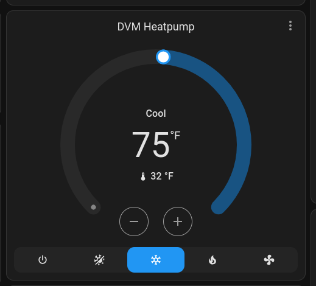

# IR Controller to control Mitsubishi Heat Pump from Home Assistant



## Motivation
I have a Mitsubishi multi-spit heat pump system. This means that there are two heat pumps in different zones that work with the same compressor unit.
One limitation of this setup is that the heat pumps must be set to the same mode. They enter a leader/follower configuration based on which device was powered on first.

This can lead to awful UX when multiple people are trying to control the climate in their rooms.

The idea with this project is to control both units from Home Assistant to automatically keep multiple rooms at the desired temperature.


## Hardware
I'm using the Atom S3R from m5stack. ($17.50 @ [m5stack store](https://shop.m5stack.com/products/atoms3r-dev-kit) )


## Software
- ESPHome for generating custom firmwware
- Home Assistant for home automation
- Make

## Getting Started

Create a virtual environment
```
virtualenv venv
. venv/bin/activate
```

populate `secrets.yaml`
```
wifi_ssid: "MY_WIFI_SSID"
wifi_password: "MY_WIFI_PASSWORD"
```

build the image and install it
```
CONFIG=m5stack-atom-s3.yaml make
```

At the end of this build process it will as you to select a device to program with generated firmware.
